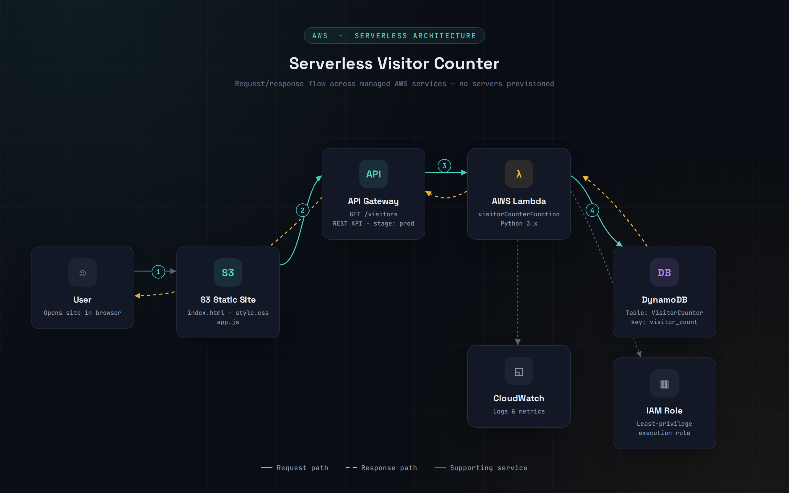

# 🚀 Serverless Visitor Counter on AWS

A fully serverless web application that tracks and displays the number of visitors using AWS managed services. The application is hosted without managing any servers and automatically updates the visitor count whenever the website is accessed.

---

## 📌 Project Overview

This project demonstrates how to build a scalable serverless application using AWS.

When a user opens the website:

1. The frontend sends a request to Amazon API Gateway.
2. API Gateway invokes an AWS Lambda function.
3. The Lambda function reads and updates the visitor count in Amazon DynamoDB.
4. The updated visitor count is returned to the website and displayed to the user.

---

## 🏗️ Architecture



---

## ☁️ AWS Services Used

- AWS Lambda
- Amazon API Gateway
- Amazon DynamoDB
- AWS IAM
- Amazon CloudWatch
- Amazon S3 (for static website hosting)

---

## 📂 Project Structure

```
aws-visitor-counter/
│
├── README.md
├── lambda/
│   └── lambda_function.py
├── frontend/
│   ├── index.html
│   ├── style.css
│   └── app.js
├── screenshots/
│   ├── website.png
│   ├── api-gateway.png
│   ├── lambda.png
│   ├── dynamodb.png
│   └── visitor-count.png
└── architecture.png
```

---

## ⚙️ Workflow

```
User
   │
   ▼
Static Website (S3)
   │
   ▼
API Gateway
   │
   ▼
AWS Lambda
   │
   ▼
Amazon DynamoDB
   │
   ▼
Updated Visitor Count
```

---

## ✨ Features

- Fully serverless architecture
- Dynamic visitor counter
- Automatic data storage in DynamoDB
- REST API using API Gateway
- Event-driven AWS Lambda function
- No server management required
- Scalable and cost-effective
- CloudWatch logging for monitoring

---

## 🛠️ Technologies Used

### Cloud

- AWS Lambda
- Amazon API Gateway
- Amazon DynamoDB
- Amazon S3
- AWS IAM
- Amazon CloudWatch

### Frontend

- HTML5
- CSS3
- JavaScript

### Backend

- Python 3.x

---

## 📸 Screenshots

### Website


---

### API Gateway


---

### AWS Lambda


---

### DynamoDB


---

### Visitor Count


---

## 🎯 Learning Outcomes

During this project I learned:

- Building serverless applications on AWS
- Creating REST APIs using API Gateway
- Developing AWS Lambda functions with Python
- Using DynamoDB for NoSQL data storage
- Configuring IAM roles and permissions
- Monitoring applications using CloudWatch
- Integrating frontend applications with backend APIs

---

## 🚀 Future Improvements

- Add authentication using Amazon Cognito
- Display visitor analytics dashboard
- Store visitor timestamps
- Enable CI/CD using GitHub Actions
- Add Infrastructure as Code using AWS SAM or Terraform

---

## 👨‍💻 Author

**Laksh Sonar**

BCA Graduate | Linux | AWS Cloud | RHCSA Learner

GitHub: https://github.com/your-username

---

## ⭐ If you found this project helpful, consider giving it a Star!
